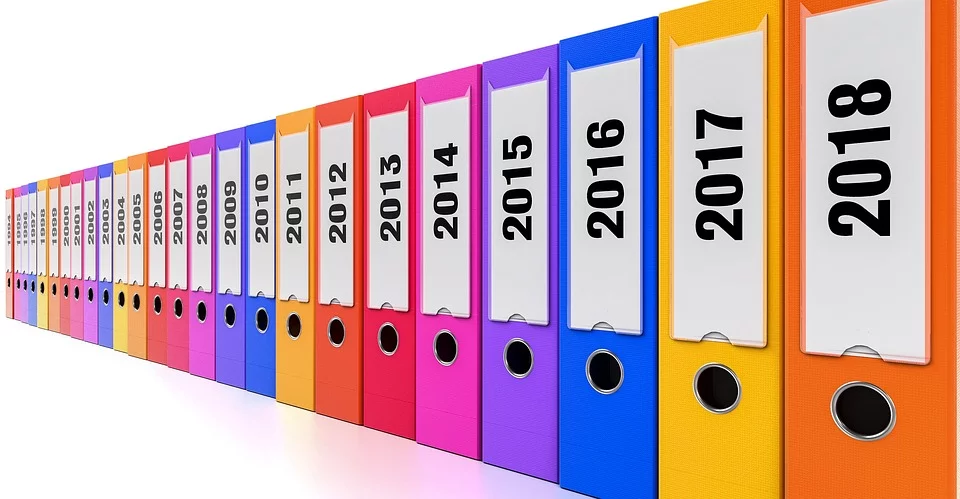
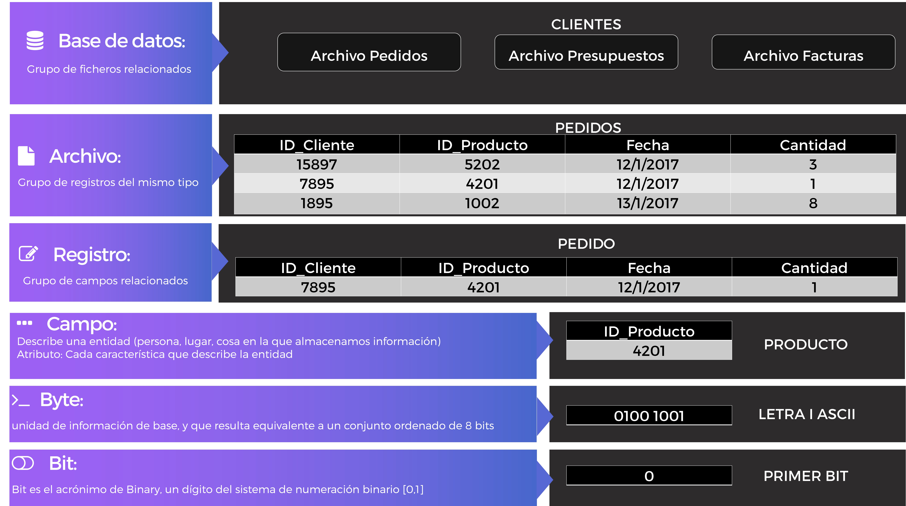
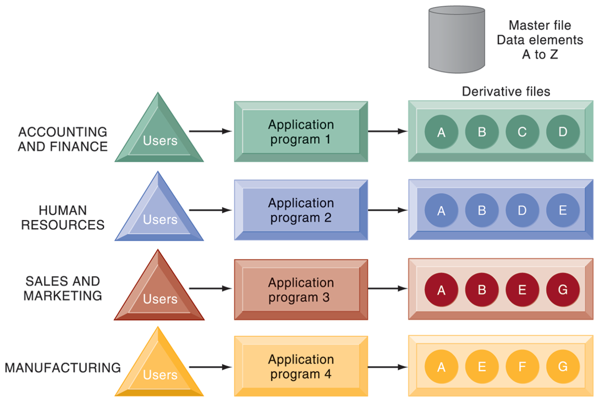

class: center, middle, remark-inverse

# 2. Organización de datos en un entorno tradicional

---
class: middle

# Sistema de información efectivo:

### - Información precisa
### - Información oportuna
### - Información relevante

.center[

## No siempre se cumple: datos mal organizados
]

---
class: middle, center

# Organización de datos

>  ## Base de datos: colección de información sobre un determinado tema.

```{r echo=FALSE, message=FALSE, warning=FALSE, out.width="95%"}


```


---

# Conceptos básicos en bases de datos

```{r echo=FALSE, message=FALSE, warning=FALSE, out.width="95%"}


```

---
class: center
# Bits vs Bytes

<iframe width="560" height="315" src="https://www.youtube.com/embed/iar-CZgFk6s" frameborder="0" gesture="media" allow="encrypted-media" allowfullscreen></iframe>

Test en [Socrative](https://socrative.com/): ADE_SI_T4_1

---
# Problemas de la gestión tradicional de datos</h3>   

.pull-left[

```{r echo=FALSE, message=FALSE, warning=FALSE, out.width="95%"}


```

]
.pull-right[
- Ficheros mantenidos de manera independiente por departamentos
- Redundancia de datos: datos duplicados
- Inconsistencia de datos
- Dependencia del software
- Falta de flexibilidad, seguridad y posibilidades de intercambio

]
                             
