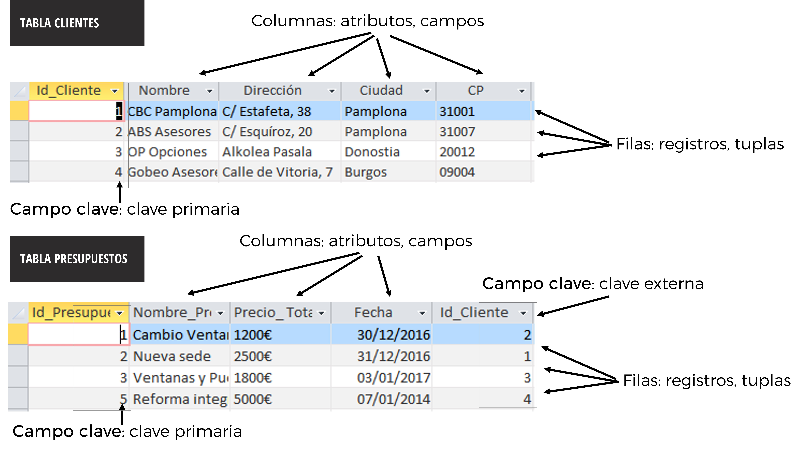
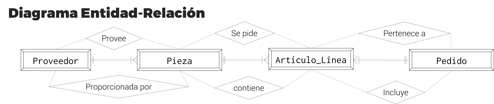

class: center, middle, remark-inverse

# 3. El enfoque de base de datos relacional


---
# Las bases de datos relacionales


.left-column[

```{r echo=FALSE, message=FALSE, warning=FALSE, out.width="100%"}


```

]
.right-column[

> **Base de datos relacional**: Colección de datos organizados para dar servicio a múltiples aplicaciones de manera eficiente al centralizar los datos y controlar los que son redundantes.

<br>

> **Sistemas de Gestión de Base de Datos (DBMS)**: Software que permite a una organización centralizar los datos, administrarlos de manera eficiente y proveer acceso a los datos almacenados mediante programas de aplicación.

]
          
---
# Dos principios básicos

### - Cada dato se introduzca una sola vez en la base de datos y se almacene en un solo lugar.

### - Las vistas se puedan personalizar y adaptar a distintas situaciones y usuarios.

---
# Tablas

### Recogen los datos sobre una entidad, e.g.:

- Tabla de clientes
- Tabla de proveedores
- Tabla de pedidos
- Tabla de facturas
- Tabla de productos…

### - Cada fila tiene una determinada entidad y todas sus características: "atributos"

### - Cada fila se identifica con un código clave único

---
# Vistas y consultas

### - Presentan la información con un determinado objetivo
### - Pueden combinar información de varias tablas
### - Se necesitan **claves primarias** y **claves secundarias** (ligan unas tablas con otras)
### - e.g: precio de venta al público de las referencias de producto que se importan desde un determinado país.


---
# Ejemplos:


.left-column[

```{r echo=FALSE, message=FALSE, warning=FALSE, out.width="100%"}


```

]
.right-column[
- Pedidos facturados a un determinado cliente.

- Retribuciones de los trabajadores de las plantas de producción con más de 20 empleados.

- Productos servidos por los proveedores de una región durante los últimos seis meses.

]
---
# Bases de datos relacionales: Conceptos básicos

| Representación lógica | Representación física | Modelo relacional |
|-----------------------|-----------------------|-------------------|
| Tabla                 | Archivo               | Relación          |
| Fila                  | Registro              | Tupla             |
| Columna               | Campo                 | Atributo          |


- Relaciones entre tablas: Claves primarias y externas (foránea)
---
# Ejemplo: una BS relacional


```{r echo=FALSE, message=FALSE, warning=FALSE, out.width="100%"}


```

---
# Diseño de bases de datos relacionales

|             |                                                       |
|--------------| ----------------------------------------------------- |
| Diseño conceptual (lógico)| modelo abstracto, perspectiva de negocio              | 
| Diseño físico             | configuración de acceso en los distintos dispositivos |
| Proceso de diseño         | identifica forma más eficiente agrupar elementos para satisfacer los requerimientos del negocio, necesidades de aplicación de los programas|


---
#  Diagramas de definición de datos y de entidad relación

> **Normalización**: Racionalización de agrupaciones complejas de datos para minimizar los elementos de datos redundantes y difíciles por su volumen

> **Reglas de identidad referencial**: comprobar que las relaciones entre tablas siguen reglas de coherencia

> **Diagrama entidad-relación**: Utilizado por programadores para documentación, muestra las relaciones entre entidades

<span style="color:red">**!**</span> Si una empresa no consigue un buen modelo de datos, el sistema no será capaz de contribuir a las decisiones de negocio.

---
# Ejemplo Normalización

```{r echo=FALSE, message=FALSE, warning=FALSE, out.width="95%"}


```
                   
---
# Ejemplo Normalización (II)

```{r echo=FALSE, message=FALSE, warning=FALSE, out.width="95%"}


```

---
# Ejemplo Normalización (III)

```{r echo=FALSE, message=FALSE, warning=FALSE, out.width="95%"}


```

---
# Actividad : Normalización

```{r echo=FALSE, message=FALSE, warning=FALSE, out.width="95%"}


```

---
# Gestión de bases de datos

### - Selección lenguaje programación: añadir, cambiar, borrar, recuperar datos de la base de datos. 

### - Lengaje más extendido: **lenguaje de consulta estructurado** o **Structured Query Language (SQL)**

### - Incorporado en muchas herramientas diferentes

### - Selección herramientas de generación de informes y vistas y consultas: misma herramienta para la generación de informes o herramientas específicas (e.g. Crystal Reports)

---
# Otros tipos de bases de datos

### - Bases de datos jerárquicas o de red

   - Información en estructura jerárquica, registros en forma de estructura de árbol, en donde un nodo padre de información puede tener varios nodos hijo, y así sucesivamente.
   - menos eficientes que las bases estructuradas

### - Bases no estructuradas: bases de datos orientadas a objetos (imágenes, video, sonido...)
      
   - Más flexibles, entidades como objetos completos y pueden integrar datos de orígenes distintos

   - En general, más lentas y menos eficientes que las relacionales
