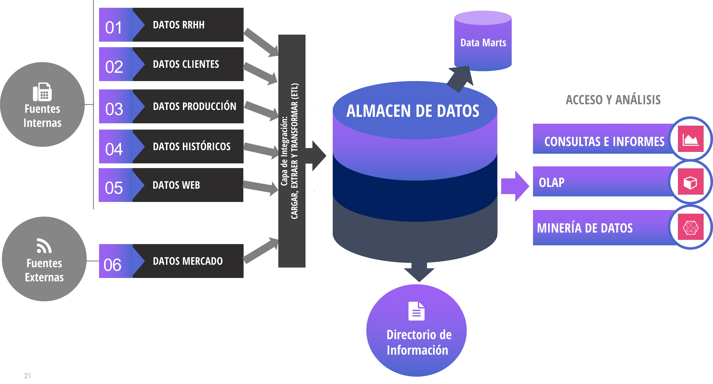

class: center, middle, remark-inverse

# 4. Business Intelligence


---
#  Business Intelligence

### - Uso de análisis de bases de datos para mejorar rendimiento empresarial y toma de decisiones

### - Capacidades para analizar cantidades enormes de datos y acceder a información de múltiples sistemas

### - Incluyen almacenes de datos, minería de datos y herramientas para acceder a las bases de datos internas a través de la web

---
#  Herramientas de Business Intelligence

```{r echo=FALSE, message=FALSE, warning=FALSE, out.width="95%"}


```

---
# Almacenes de datos

.pull-left[

### - Almacén global de la información actual e histórica de interés para la toma de decisiones
### - ETL (Extract, Transform, Load), Datawarehouse y DataMarts

]

.pull-right[
<iframe width="380" height="180" src="https://www.youtube.com/embed/vb0OAhQFoXY" frameborder="0" gesture="media" allow="encrypted-media" allowfullscreen></iframe>

 <a style="margin:0; font-size:0.7em" href="https://b.socrative.com/teacher/#edit-quiz/26563176" target="_blank">Socrative.SI_ADE_T4_2 </a>
]


---
# Herramientas de Business Intelligence: Análisis

###  - Consultas e informes: Excel, Crystal Reports, Dashboards...
### - Análisis Multidimensional (OLAP): Visualización de datos de múltiples dimensiones, permite respuestas rápidas en línea y consultas ad-hoc
### - Modelos estadísticos y de inteligencia artificial: Estadística descriptiva (cluster, MDA...) y predictiva (econometría, series temporales..., aprendizaje supervisado (predictivo, eg: redes neuronales) y no supervisado (descriptivo, eg: algoritmos genéticos) 

              