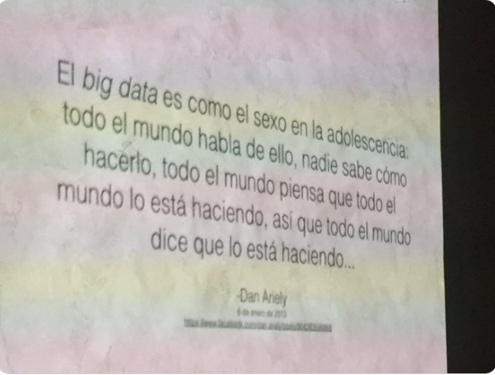
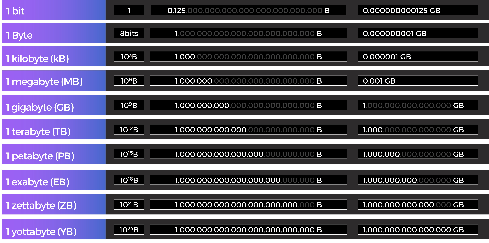
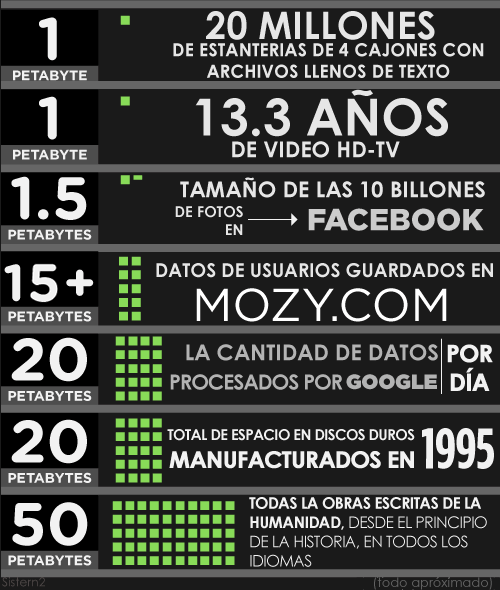
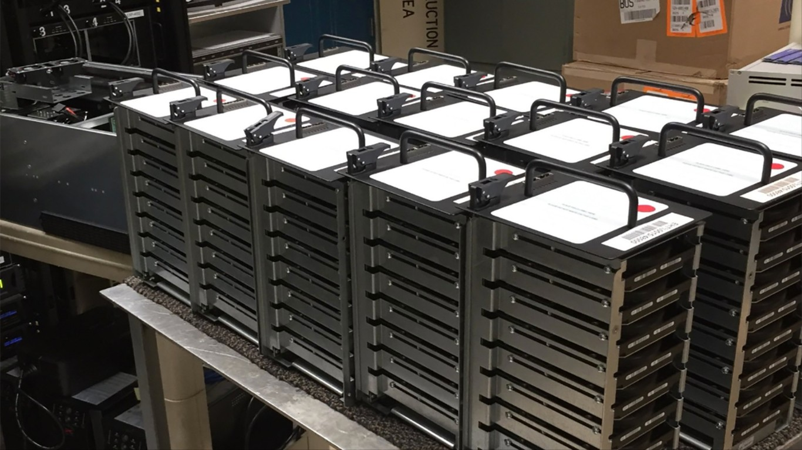
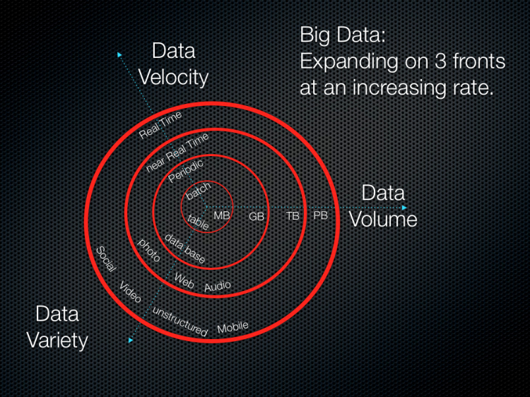
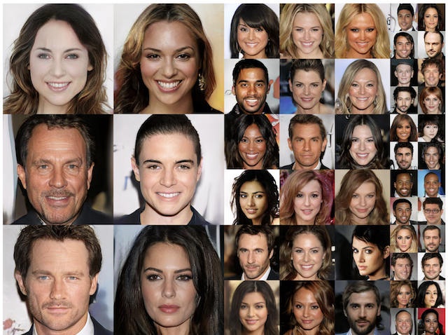

class: center, middle, remark-inverse

# 5. Big Data e Inteligencia Artificial


---
# ¿Qué es Big Data?

.pull-left[
> Conjunto masivo de datos no estructurados o semi-estructurados de tráfico de Web, social media, sensores, etc…

]

.pull-right[

```{r echo=FALSE, message=FALSE, warning=FALSE, out.width="80%"}


```

<blockquote class="twitter-tweet"><p lang="es" dir="ltr">Sobre <a href="https://twitter.com/hashtag/bigdata?src=hash&amp;ref_src=twsrc%5Etfw">#bigdata</a> e investigación <a href="https://t.co/pMpWnuReF3">pic.twitter.com/pMpWnuReF3</a></p>
]

---

# ¿Cuánto es grande?

```{r echo=FALSE, message=FALSE, warning=FALSE, out.width="90%"}


```

---
# ¿Qué cabe en un Petabyte?

.center[

```{r echo=FALSE, message=FALSE, warning=FALSE, out.width="50%"}


```

<p style="margin:0; font-size:0.3em"><em><a href="https://mozy.ie/#slide-9" target="_blank">Fuente infografía: www.mozy.com</a> </em></p>

]
---
# e.g. Fotografía agujero negro

<small>[La primera foto de un agujero negro supuso 5 petabytes de datos y fue más fácil enviarlos por avión que por Internet](https://www.xataka.com/espacio/primera-foto-agujero-negro-supuso-5-petabytes-datos-fue-facil-enviarlos-avion-que-internet)</small>

.pull-left[

```{r echo=FALSE, message=FALSE, warning=FALSE, out.width="90%"}


```
]


.pull-right[

```{r echo=FALSE, message=FALSE, warning=FALSE, out.width="90%"}


```
]


---
# ¿Solo tamaño?

.pull-left[

### - **V**olumen
### - **V**elocidad
### - **V**ariedad

]

.pull-right[

```{r echo=FALSE, message=FALSE, warning=FALSE, out.width="100%"}


```
<p style="margin:0; font-size:0.3em"><em><a href="http://www.datasciencecentral.com/forum/topics/the-3vs-that-define-big-data" target="_blank">Fuente imagen: Data Science Central</a> </em></p>
]


---
# Inteligencia Artificial

> ### Capacidad de una máquina para aprender como respuesta a los estímulos y acomodar su comportamiento a ese aprendizaje.

.pull-left[

 - AI en Business Intelligence: algoritmos y técnicas de análisis y predicciones a partir de grandes volúmenes de datos de información corporativa.

]

.pull-right[

```{r echo=FALSE, message=FALSE, warning=FALSE, out.width="70%"}


```
]


---
# Aplicaciones AI en mundo corporativo

### - Selección de recursos humanos
### - Predicción de riesgo de abandono de clientes
### - Predicción de la probabilidad de compra
### - Clasificación del email…

---
# Herramientas más importantes para AI y Big Data:

### - Lenguajes de programación: Python y R con RStudio
### - Plataformas distribuidas: Apache Spark, Apache Hadoop
### - Plataformas de trabajo: Jupyter, Anaconda
### - Algoritmos de libre uso: BERT y otros, OpenAI


